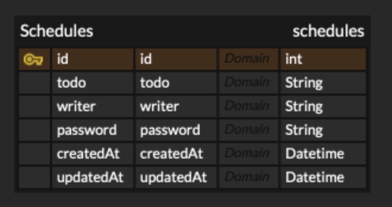

# API 명세서

---

##  Schedules

### 1. 전체 일정 조회

| Method | URL        | descripe        |
|:------:|------------|:----------------|
|  GET   | /schedules | 전체 일정을 가지고 옵니다. |

전체 일정을 가지고 옵니다.

### 파라미터

|    이름     | 타입       | 설명                                                                                                 |
|:---------:|----------|:---------------------------------------------------------------------------------------------------|
|    id     | Integer  | 일정 아이디                                                                                             |
|   todo    | String   | 일정 내용                                                                                              |
|  writer   | String   | 작성자명                                                                                               |
| password  | String   | 비밀번호                                                                                               |
| createdAt | Datetime | 작성일, ISO 8601<br/>[YYYY]-[MM]-[DD]T[hh]:[mm]:[ss]                                                  |
| updatedAt | Datetime | 수정일, ISO 8601<br/>[YYYY]-[MM]-[DD]T[hh]:[mm]:[ss]                                                  |

**Response**
```json=
{
    schedules:[
        {
            id:"1",
            todo:"장보기",
            name:"김르탄",
            password:"1234",
            createdAt:"2024-10-30 13:00:00",
            updatedAt:"2024-10-31 18:00:00"
        }
        ...
    ]
}
```

| Code |    Description     |
|:----:|:------------------:|
| 200  | 목록 가져오기 성공 |
| 400  | 목록 가져오기 실패 |
| 401  |     권한 없음      |


---
### 2. 선택 일정 조회

| Method | URL             | descripe         |
|:------:|-----------------|:-----------------|
|  GET   | /schedules/{id} | 선택한 일정을 가지고 옵니다. |

 
선택한 일정을 가지고 옵니다.

### 파라미터

|    이름     | 타입       | 설명                                                                                  |
|:---------:|----------|:------------------------------------------------------------------------------------|
|    id     | Integer  | 일정 아이디                                                                              |
|   todo    | String   | 일정 내용                                                                               |
|  writer   | String   | 작성자명                                                                                |
| password  | String   | 비밀번호                                                                                |
| createdAt | Datetime | 작성일, ISO 8601<br/>[YYYY]-[MM]-[DD]T[hh]:[mm]:[ss]                                   |
| updatedAt | Datetime | 수정일, ISO 8601<br/>[YYYY]-[MM]-[DD]T[hh]:[mm]:[ss]                                   |

**Response**
```json=
{     
    id:"2",
    todo:"공부하기",
    name:"김르탄",
    password:"1234",
    createdAt:"2024-10-30 13:00:00",
    updatedAt:"2024-10-31 18:00:00"   
}
```

| Code | Description |
|:----:|:-----------:|
| 200  | 일정 가져오기 성공  |
| 400  | 일정 가져오기 실패  |
| 401  |    권한 없음    |


---
### 3. 일정 생성

| Method | URL        | descripe                         |
|:------:|------------|:---------------------------------|
|  POST  | /schedules | Request를 보내면 그에 맞게 일정 DB에 추가합니다. |

### 파라미터

|    이름     | 타입       | 설명                                                |
|:---------:|----------|:--------------------------------------------------|
|    id     | Integer  | 일정 아이디                                            |
|   todo    | String   | 일정 내용                                             |
|   name    | String   | 작성자명                                              |
| password  | String   | 비밀번호                                              |
| createdAt | Datetime | 작성일, ISO 8601<br/>[YYYY]-[MM]-[DD]T[hh]:[mm]:[ss] |
|   state   | String   | 상태코드                                              |

**Request**
```json=
{
    todo:"공부하기",
    name:"홍길동",
    password:"1234",
    createdAt:"2024-10-31 18:00:00"
}
```
일정을 새로 추가합니다.

**Response**
```json=
{
    id:"3",
    state:"200"
}
```

| Code | Description |
|:----:|:-----------:|
| 200  |  일정 등록 성공   |
| 400  |  일정 등록 실패   |
| 401  |    권한 없음    |


---
### 4. 일정 수정

| Method | URL             | descripe                              |
|:------:|-----------------|:--------------------------------------|
| Patch  | /schedules/{id} | Request 를 보내면 그에 맞게 일정 DB에 정보를 변경합니다. |

### 파라미터

|    이름     | 타입       | 설명                                                |
|:---------:|----------|:--------------------------------------------------|
|    id     | Integer  | 일정 아이디                                            |
|   todo    | String   | 일정 내용                                             |
|   name    | String   | 작성자명                                              |
| password  | String   | 비밀번호                                              |
| updatedAt | Datetime | 수정일, ISO 8601<br/>[YYYY]-[MM]-[DD]T[hh]:[mm]:[ss] |
|   state   | String   | 상태코드                                              |

**Request**
```json=
{
    id:"5",
    todo:"식사하기",
    name:"김르탄",
    password:"1234",
    updatedAt:"2024-10-31 18:00:00",
}
```
일정을 수정합니다.

**Response**
```json=
{
    state:"200"
}
```

| Code | Description |
|:----:|:-----------:|
| 200  |  일정 변경 성공   |
| 400  |  일정 변경 실패   |
| 401  |    권한 없음    |


---
### 5. 일정 삭제

| Method | URL             | descripe                               |
|:------:|-----------------|:---------------------------------------|
| Delete | /schedules/{id} | Request 를 보내면 그에 맞게 일정 DB에서 정보를 삭제합니다. |

### 파라미터
|  이름   | 타입       | 설명     |
|:-----:|----------|:-------|
|  id   | Integer  | 일정 아이디 |
| state | String   | 상태코드   |

**Request**
```json=
{
    id:"2"
}
```
일정을 삭제합니다.

**Response**
```json=
{
    state:"200"
}
```

| Code | Description |
|:----:|:-----------:|
| 200  |  일정 삭제 성공   |
| 400  |  일정 삭제 실패   |
| 401  |    권한 없음    |


---
